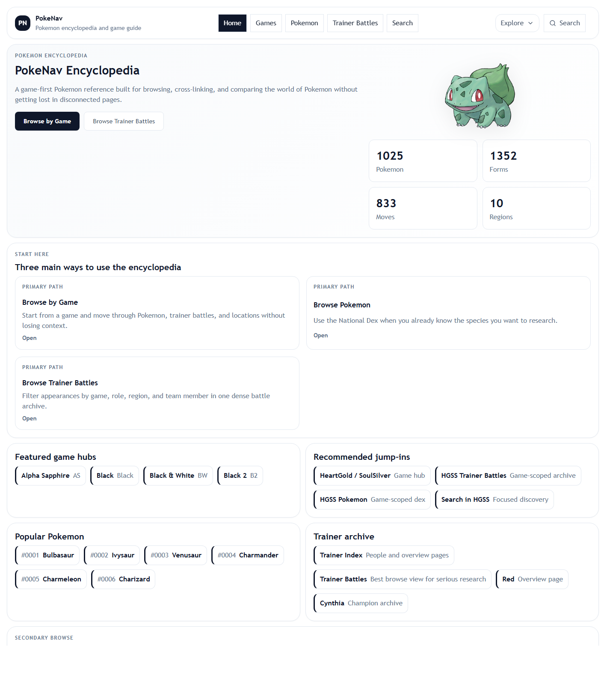
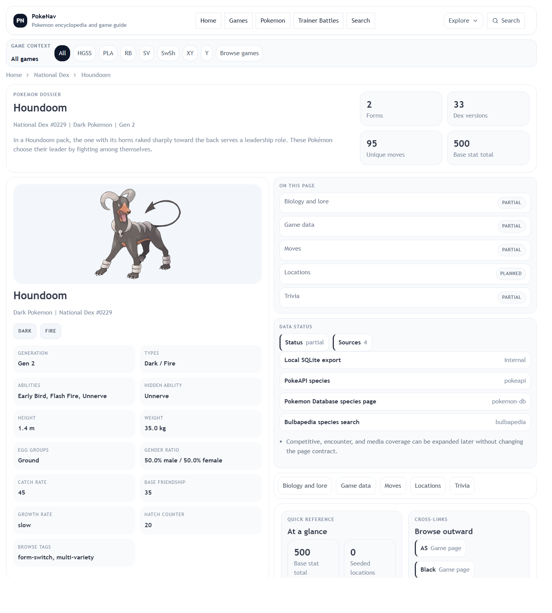
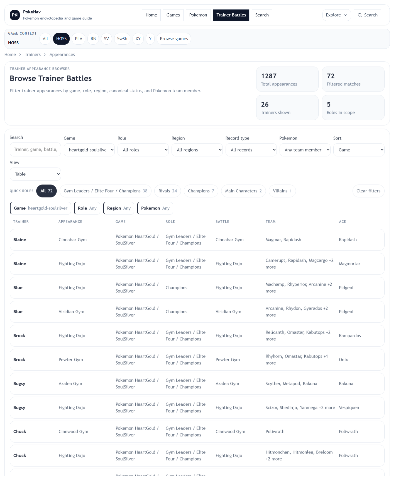
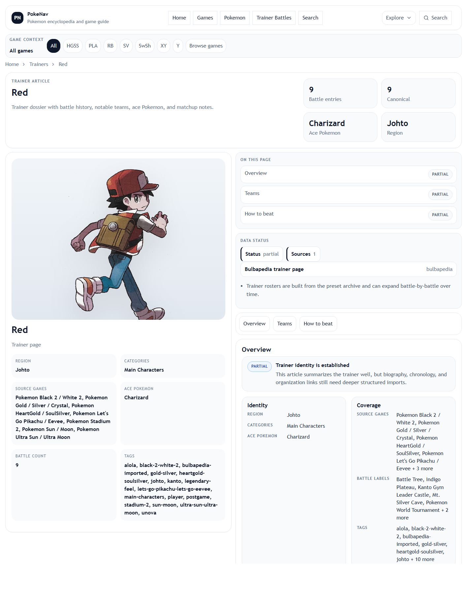

# PokeNav

PokeNav is a game-first Pokemon encyclopedia built as a local-first React app.

It is meant to feel closer to a research tool than a simple Pokedex list: browse by game, inspect Pokemon articles, compare species, study trainer battles, and move laterally through related entities without depending on heavy live client-side API hydration.

- Live site: [teamstarwolf.github.io/PokeNav](https://teamstarwolf.github.io/PokeNav/)
- Project docs: [docs/README.md](docs/README.md)
- Contributing guide: [CONTRIBUTING.md](CONTRIBUTING.md)

## Screenshots

### Home



### Pokemon article



### Trainer battles browser



### Trainer article



## What PokeNav focuses on

The current product direction is centered around three browse paths:

1. `Games`
2. `Pokemon`
3. `Trainer Battles`

Everything else in the encyclopedia is meant to support those flows:

- game hubs with scoped Pokemon, trainer, and location views
- cross-linked Pokemon, move, ability, item, region, type, and location pages
- trainer person pages and game-specific trainer appearance pages
- search, compare, and filter-heavy browsing

## Key features

- Local generated encyclopedia data under `public/data`
- National Dex browsing with filters, sorting, and search
- Game-aware browsing and persistent game context
- Pokemon article pages with forms, learnsets, locations, stats, and cross-links
- Separate full learnset pages to avoid overloading main Pokemon articles
- Trainer archive with:
  - trainer overview pages
  - trainer appearance pages
  - trainer battle browser
  - imported local trainer portraits
- Import/export support for custom team sets
- Tests for formatting, storage, security, encyclopedia helpers, and trainer data

## Architecture

PokeNav is schema-first.

The app is built around normalized encyclopedia entities and route helpers so it can keep expanding without turning into page-specific hardcoded data.

Important areas:

- `src/pages/encyclopedia/`
  Route-level pages
- `src/components/encyclopedia/`
  Shared shell, article, and browse components
- `src/lib/`
  Schema, helpers, storage, and security logic
- `src/hooks/`
  Data access and route data loading
- `src/data/`
  Curated and generated data helpers
- `scripts/`
  Export and generation tooling

## Source policy

PokeNav uses multiple sources with different jobs:

- `PokeAPI`
  Structured machine data and IDs
- `Bulbapedia`
  Canon and game-specific validation
- `Pokemon Database`
  Mechanics cross-checks
- `Pokebase`
  Secondary browse/reference validation

More detail lives in [docs/source-policy.md](docs/source-policy.md).

## Local setup

Install dependencies:

```bash
npm install
```

Generate runtime datasets:

```bash
npm run generate:trainers
npm run generate:encyclopedia
```

Start the local dev server:

```bash
npm run dev:local
```

Open [http://127.0.0.1:4173/](http://127.0.0.1:4173/).

## Refreshing the local Pokemon export

If the local SQLite database or artwork cache changes, rebuild the raw Pokemon dataset too:

```bash
npm run generate:data
```

That export writes runtime JSON into `public/data`.

## Test and build

```bash
npm test
npm run build
```

## Common scripts

| Command | Purpose |
| --- | --- |
| `npm run dev` | Start Vite in normal development mode |
| `npm run dev:local` | Start local-only dev server on `127.0.0.1:4173` |
| `npm run preview:local` | Preview the production build locally on `127.0.0.1:4173` |
| `npm run generate:data` | Export Pokemon runtime JSON from the local SQLite database |
| `npm run generate:trainers` | Export trainer reference JSON |
| `npm run generate:encyclopedia` | Generate the encyclopedia dataset |
| `npm test` | Run Vitest |
| `npm run build` | Type-check and build for production |

## Current status

PokeNav is already usable and deployable, but it is still being shaped toward a stronger public release.

Current strengths:

- game-first browse flows
- trainer battle browsing
- local-first runtime data
- stronger security and import hardening
- route-level chunk splitting and lighter initial load

Still being improved:

- mobile density and navigation compression
- completeness of some article sections
- deeper game-aware related navigation
- richer normalized trainer and location data

The public-release direction is tracked in [ROADMAP.md](ROADMAP.md) and [docs/public-release-plan.md](docs/public-release-plan.md).

## Documentation map

- [docs/README.md](docs/README.md)
  Full docs index
- [ROADMAP.md](ROADMAP.md)
  Product direction and next milestones
- [docs/data-pipeline.md](docs/data-pipeline.md)
  Runtime JSON generation and loading
- [docs/pokemon-system.md](docs/pokemon-system.md)
  Pokemon species pages, forms, learnsets, game context, and data flow
- [docs/routes-and-pages.md](docs/routes-and-pages.md)
  Route overview
- [docs/trainer-system.md](docs/trainer-system.md)
  Trainer identity, appearance pages, and archive data
- [docs/security-hardening.md](docs/security-hardening.md)
  Dependency, link, import, and browser-policy hardening

## Notes

- The app name is `PokeNav`.
- The project is intentionally local-first and does not depend on mass browser-side live hydration from PokeAPI.
- Missing data should be treated honestly in the UI with partial/planned states rather than implied completeness.
