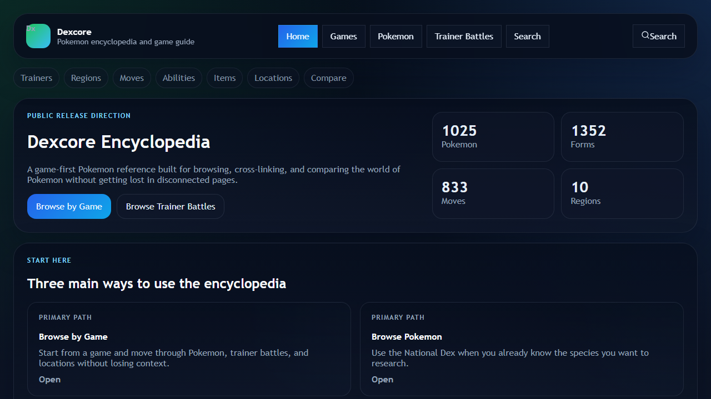
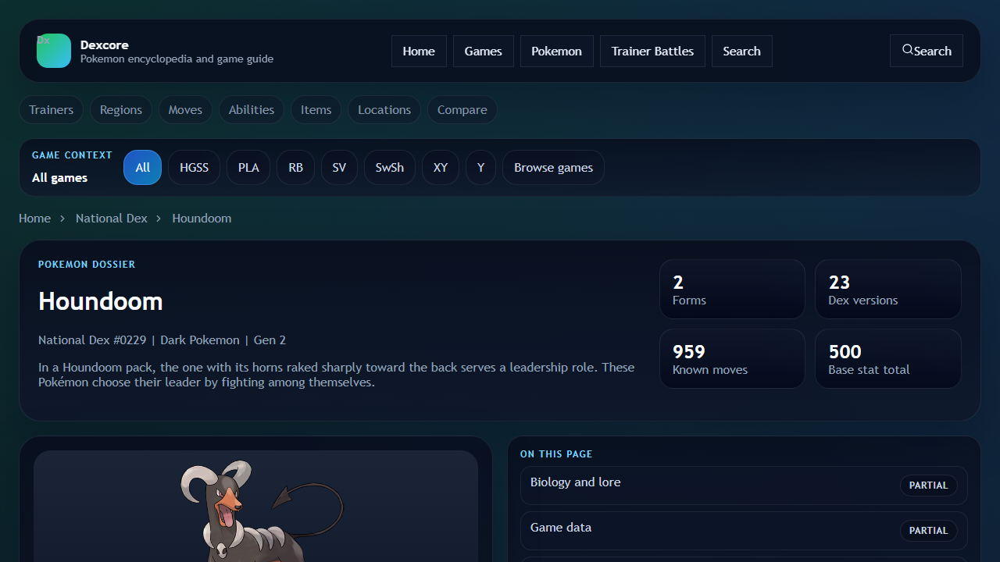
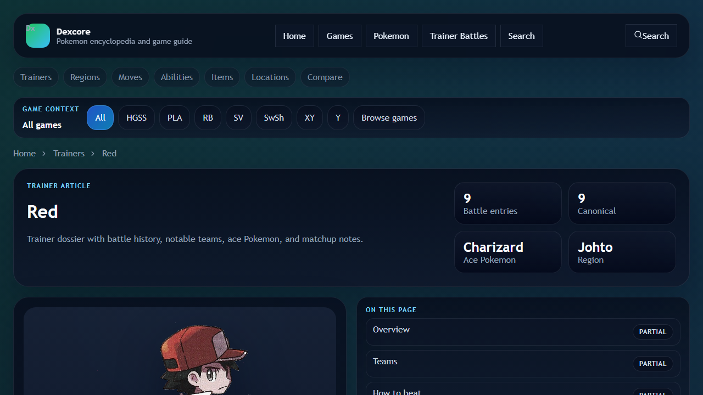
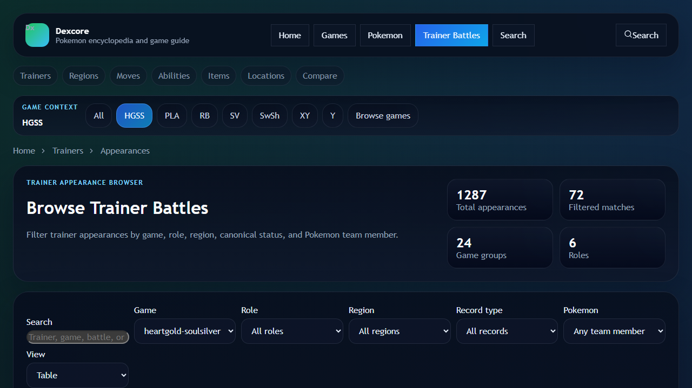

<div align="center">
  

  # PokeNav

  [](https://react.dev)
  [](https://vite.dev)
  [](https://www.typescriptlang.org/)
  [](https://teamstarwolf.github.io/PokeNav/)
  [](.github/workflows)

  **[Live Site](https://teamstarwolf.github.io/PokeNav/)** | **[Docs](docs/README.md)** | **[Roadmap](ROADMAP.md)** | **[Contributing](CONTRIBUTING.md)** | **[Security](SECURITY.md)**
</div>

---

PokeNav is an offline-first Pokemon encyclopedia built with React, Vite, and TypeScript. It is designed around game-aware browsing, linked entity pages, local generated datasets, and honest completeness signaling instead of a flat one-screen Pokedex grid.

## What PokeNav Focuses On

PokeNav currently has three strongest browse paths:

1. browse by game
2. browse Pokemon directly
3. browse trainer battles and appearances

Everything else in the app is meant to support those flows with linked pages for moves, abilities, items, types, regions, and locations.

## Feature Highlights

| Area | What is available now |
| --- | --- |
| Game-first browsing | game hub pages, game-scoped Pokemon, trainer, and location indexes |
| Pokemon encyclopedia | national dex, species pages, move pages, form pages, and compare flows |
| Trainer archive | trainer index, trainer detail pages, appearance browser, and game-specific battle records |
| Linked reference data | moves, abilities, items, locations, regions, and cross-entity search |
| Offline-first delivery | static JSON datasets served locally or from GitHub Pages |
| Honest completeness | partial or curated data is labeled instead of implied as complete |

## Screenshots

<table>
<tr>
<td width="50%"><strong>Home + Browse Entry Points</strong><br></td>
<td width="50%"><strong>Pokemon Article Page</strong><br></td>
</tr>
<tr>
<td><strong>Trainer Detail Surface</strong><br></td>
<td><strong>Trainer Appearance Browser</strong><br></td>
</tr>
</table>

## Source And Data Model

PokeNav uses a source hierarchy instead of treating every Pokemon website as interchangeable.

- `PokeAPI` is the primary structured source for identifiers, forms, slugs, and machine-readable imports.
- `Bulbapedia` is the primary encyclopedia reference for trainer canon, game-specific appearances, and world context.
- `Pokemon Database` is used as a readable mechanics cross-check.
- `Pokebase` is a secondary browse/reference comparison source.

If a page claims certainty, the backing data should either come from a strong source or be clearly labeled as `partial`, `derived`, or `curated`.

## Quick Start

```bash
npm install
npm run dev
```

For a stable local bind:

```bash
npm run dev:local
```

## Data Generation

PokeNav expects locally generated JSON datasets. Depending on what you are refreshing, use:

```bash
npm run generate:data
npm run generate:trainers
npm run generate:encyclopedia
```

These scripts rely on the local SQLite build and project assets described in the docs.

## Test And Build

```bash
npm test
npm run build
```

## Project Shape

```text
src/
  components/encyclopedia/   Shared browse and article UI
  pages/encyclopedia/        Route-level encyclopedia pages
  lib/                       Schemas, linking, transforms, and security helpers
  hooks/                     Route data and loading hooks
  data/                      Curated seed records
scripts/                     Import and export tooling
public/data/                 Generated runtime datasets
docs/                        Product, architecture, and maintenance handbook
```

## Documentation

| Document | Purpose |
| --- | --- |
| [docs/README.md](docs/README.md) | documentation index and onboarding path |
| [ROADMAP.md](ROADMAP.md) | current direction, gaps, and release priorities |
| [docs/encyclopedia-architecture.md](docs/encyclopedia-architecture.md) | schema and route architecture |
| [docs/routes-and-pages.md](docs/routes-and-pages.md) | route map and browse purpose for each page family |
| [docs/data-pipeline.md](docs/data-pipeline.md) | how local JSON data is generated and loaded |
| [docs/source-policy.md](docs/source-policy.md) | source hierarchy and data trust rules |
| [docs/security-hardening.md](docs/security-hardening.md) | current browser-side hardening and import safeguards |

## Security

PokeNav is a static web app, so the most important security concerns are browser policy, dependency health, external link sanitization, and local import safety.

- External links are sanitized before rendering.
- Team-set imports are bounded and normalized.
- The static build ships with a CSP meta tag.
- GitHub Actions run CodeQL, OSV-Scanner, Bandit for Python helper scripts, and dependency review.

See [SECURITY.md](SECURITY.md) and [docs/security-hardening.md](docs/security-hardening.md) for the current posture and reporting guidance.

## Contributing

Contributions should make the encyclopedia easier to browse, more truthful about data completeness, and easier to extend.

- favor reusable schema-first work over one-off page logic
- preserve game-specific differences where possible
- keep browse surfaces fast and scannable
- avoid polished-looking sections that imply completeness when the data is still partial

See [CONTRIBUTING.md](CONTRIBUTING.md) for development expectations.

## Project Status

PokeNav is already usable as a local reference app, but it is still in active refinement before a fuller public-ready release. The strongest current surfaces are the game hubs, Pokemon encyclopedia pages, and trainer appearance browser.

## License

[MIT License](LICENSE) for the code in this repository.

Pokemon names, characters, artwork, and franchise materials remain property of their respective rights holders. PokeNav is an unofficial fan/reference project.
